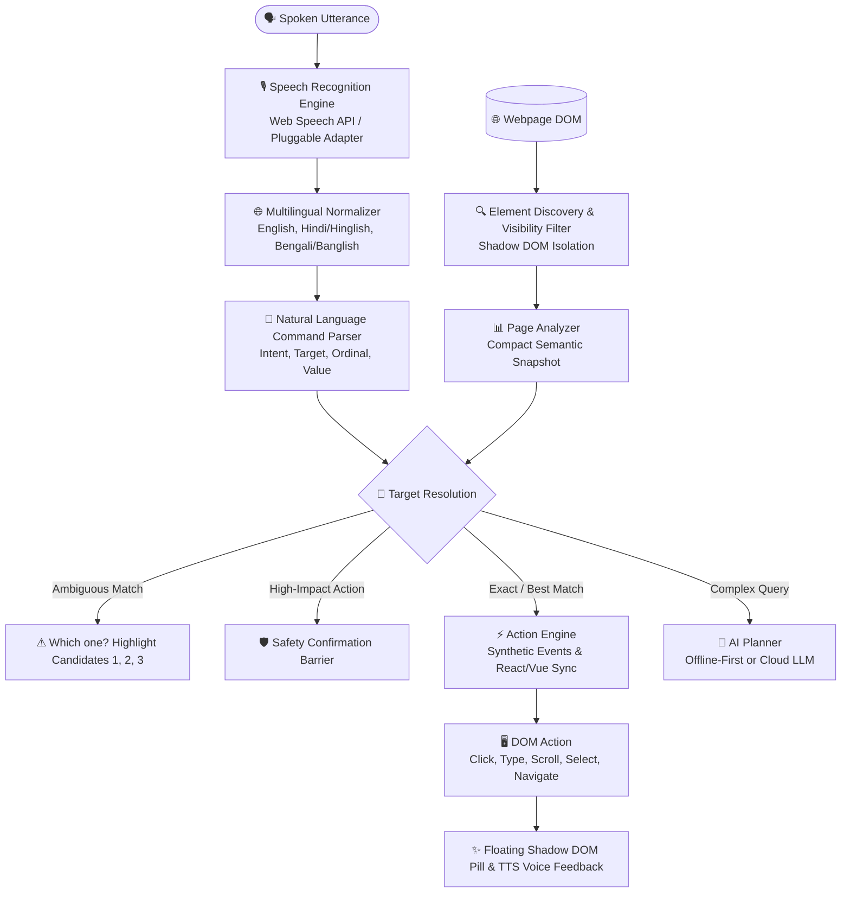

# 🎙️ VoxNav — Universal Voice Navigation for the Web

> **"Speak. Navigate. Control the Web."**  
> A production-quality, accessibility-first Chromium browser extension (Manifest V3) that turns natural spoken language into browser actions on **any** website.

[](https://developer.chrome.com/docs/extensions/mv3/intro/)
[](https://www.typescriptlang.org/)
[](https://esbuild.github.io/)
[](https://opensource.org/licenses/MIT)

---

## 💡 Why VoxNav Exists

Traditional accessibility and voice solutions are often fragmented:
1. **Per-site voice widgets** only work if a specific web application implements them.
2. **Generic screen readers** read raw DOM elements sequentially, which is tedious and slow for hands-free navigation.
3. **Rigid speech assistants** require memorized command syntaxes (e.g. `CLICK ID_124`).

**VoxNav solves this by creating a universal, voice-controlled interaction layer directly in the browser.** Instead of hard-coding selectors for any one site, VoxNav dynamically analyzes the current page's semantics, resolves your natural spoken intent, and executes safe browser actions with visual and spoken feedback.

---

## 🏗️ Technical Architecture



---

## ✨ Core Features

### 1. 🔍 Universal Page Inspection & Dynamic Element Targeting
* **No hardcoded selectors**: Works across GitHub, Wikipedia, Google, YouTube, SaaS dashboards, and e-commerce stores.
* **Deep Semantic Analysis**: Evaluates visible text, ARIA attributes (`aria-label`, `aria-labelledby`), button roles, placeholders, titles, and proximity labels.
* **Fuzzy & Synonym Matching**: Resolves `"Sign In"` when you say `"Login"`, or `"Shopping Bag"` when you say `"Cart"`.

### 2. 🔢 Numbered Element Navigation Mode (Accessibility Powerhouse)
* Say *"Show numbers"* or click the **123** button on the floating pill.
* VoxNav overlays crisp, non-invasive numbered badges (`[1]`, `[2]`, `[3]`, ...) over all visible interactive targets.
* Speak *"Click 3"* or *"Number 5"* to interact instantly without needing to pronounce complex link names.

### 3. 🛡️ Offline-First Architecture & Safety Confirmation Barrier
* **Zero Cloud Latency for 95% of Actions**: Clicks, scrolls, form typing, and tab navigation are executed 100% locally on your machine.
* **Safety Confirmation**: Detects destructive/high-impact actions (e.g. *"Delete account"*, *"Pay ₹4,999"*, *"Checkout"*), pauses execution, and prompts: *"VoxNav is ready to proceed. Say 'Confirm' to continue."*
* **Zero Arbitrary Code Execution**: Enforces a strict action whitelist. No `eval()` or dynamic JavaScript injection.

### 4. 🌐 Multilingual & Dialect Support
* Built-in natural parsing for:
  * **English**: *"Click the get started button"*, *"Scroll down a little"*.
  * **Hindi & Hinglish**: *"Login button pe click karo"*, *"Page ko neeche scroll karo"*, *"Search karo Python"*.
  * **Bengali & Banglish**: *"লগইন বাটনে ক্লিক করো"*, *"পেজ নিচে স্ক্রোল করো"*, *"সার্চ করো"*.
* Automatically parses spoken Indic number glyphs (e.g., `১, ২, ৩` or `१, २, ३` $\to$ `1, 2, 3`).

### 5. 🎨 Non-Invasive Modern Floating Overlay
* Rendered inside an isolated **Web Component Shadow DOM** (`#voxnav-root`), guaranteeing **zero CSS collisions** with host websites.
* Draggable widget showing real-time states:
  * `● Ready`
  * `● Listening...` (pulsing red indicator)
  * `◌ Understanding...`
  * `→ Executing: Clicking "Login"`
  * `✓ Done: Button clicked`
  * `⚠ Which one? 3 matching buttons found`

---

## 🗣️ Supported Voice Commands Cheat Sheet

| Category | Example Voice Command | Action Taken |
| :--- | :--- | :--- |
| **Clicking** | *"Click the login button"* | Finds the most relevant login button/link and triggers click |
| **Descriptions** | *"Click the button that says Get Started"* | Matches exact text inside quotes or descriptions |
| **Numbered Targets** | *"Click 3"* or *"Number 12"* | Directly clicks target labeled `[3]` or `[12]` |
| **Navigation** | *"Open the pricing page"* | Finds link to pricing/plans and navigates |
| **History** | *"Go back"*, *"Go forward"*, *"Refresh"* | Standard browser history and reload actions |
| **Scrolling** | *"Scroll down a little"*, *"Scroll up"* | Smoothly scrolls viewport by calibrated delta |
| **Page Bounds** | *"Scroll to top"*, *"Scroll to bottom"* | Jumps directly to top or footer of webpage |
| **Search** | *"Search for Python tutorials"* | Finds page search input, fills query, and submits |
| **Form Inputs** | *"Fill my name as Ayushman"* | Targets input labeled 'name' and types value (React/Vue safe) |
| **Clear Fields** | *"Clear the search box"* | Empties targeted text input |
| **Dropdowns** | *"Select India"* | Selects matching `<option>` in dropdown menu |
| **Checkboxes** | *"Check remember me"* | Toggles matching checkbox or radio button |
| **Form Submit** | *"Submit the form"* | Submits active form or clicks primary submit button |
| **Reading** | *"Read this page"*, *"Describe this page"* | Summarizes page title, primary heading, and available actions |
| **Numbers Mode** | *"Show numbers"*, *"Hide numbers"* | Toggles overlay badges over all clickable elements |
| **Browser Tabs** | *"New tab"*, *"Close tab"*, *"Next tab"* | Manages browser tabs via Chrome Tabs API |
| **Interactive Demo**| *"Start demo"* | Runs the automated demonstration sequence |

---

## 🚀 Installation & Loading in Chrome

### Prerequisites
* Google Chrome, Brave, Microsoft Edge, or any Chromium-based browser.
* Node.js 18+ (only if you want to rebuild source files).

### Quick Load (Ready-to-Use)
1. Open Chrome and navigate to:
   ```
   chrome://extensions
   ```
2. Enable **Developer mode** using the toggle switch in the top-right corner.
3. Click the **Load unpacked** button in the top-left.
4. Select the directory:
   ```
   c:\Users\ayush\Desktop\MLH\SIH_voice_Nav\Extension
   ```
5. **VoxNav is now installed!** You will see the blue VoxNav icon in your Chrome toolbar.

---

## ⌨️ How to Use

1. **Activate Voice**:
   * Click the **VoxNav extension icon** in your toolbar $\to$ click `Start Voice Navigation`.
   * **OR** press the keyboard shortcut: **`Ctrl + Shift + V`** (Mac: `Command + Shift + V`).
   * **OR** click the floating `🎙️ Speak` pill on any webpage.
2. **Grant Microphone Access**: Chrome will prompt for microphone permission once. Click **Allow**.
3. **Speak Naturally**: Say *"Click login"*, *"Scroll down"*, or *"Show numbers"*.

---

## 🛠️ Development & Building from Source

The repository contains clean, modular TypeScript source code in `src/`:

```
Extension/
├── manifest.json            # Manifest V3 extension configuration
├── package.json             # Dev dependencies & build scripts
├── tsconfig.json            # TypeScript configuration
├── build.js                 # Ultra-fast esbuild bundler
├── icons/                   # 16, 32, 48, 128px PNG extension icons
├── dist/                    # Compiled, browser-ready bundles
│   ├── background.bundle.js
│   ├── content.bundle.js
│   ├── popup/
│   └── options/
└── src/
    ├── background/          # Background service worker
    ├── content/             # DOM discovery, analyzer, labeler, action engine, overlay
    ├── voice/               # Web speech, command parser, TTS, multilingual layer
    ├── ai/                  # AI planner, system prompts, schemas
    ├── popup/               # Extension popup UI & controller
    ├── options/             # Settings page & interactive playground
    └── shared/              # Types, constants, safety validator, fuzzy utils
```

### Commands:
```powershell
# Install dev dependencies
npm install

# Build production bundles to dist/
npm run build

# Run TypeScript typecheck
npm run typecheck
```

---

## 🧪 Testing Checklist

Verify VoxNav against diverse web page types:
- [x] **Simple website**: Buttons, links, headings (`example.com`, `wikipedia.org`).
- [x] **Search engine**: Search box discovery, typing, auto-submitting (`google.com`).
- [x] **E-commerce**: Product cards, price filtering, "Add to cart" buttons.
- [x] **Form heavy**: Name, email, select dropdowns, checkboxes, submit buttons.
- [x] **Modern Single Page Apps (SPA)**: React/Vue/Next.js dynamic DOM updates handled via `MutationObserver`.
- [x] **Ambiguous Elements**: Disambiguation mode prompts with candidate numbers `[1]`, `[2]`.
- [x] **Safety Barrier**: Destructive commands trigger confirmation checks.

---

## 🔒 Privacy & Security

* **No Persistent Audio Recording**: Microphone is strictly deactivated when not in listening mode.
* **Minimal Context**: Form passwords, hidden inputs, and session tokens are **never** extracted or sent to any LLM.
* **Content Security Policy**: Zero inline `eval` or remote script loading.
* **Strict Whitelist**: Actions are validated against predefined safe intent primitives.

---

## 📜 License
Distributed under the **MIT License**.
